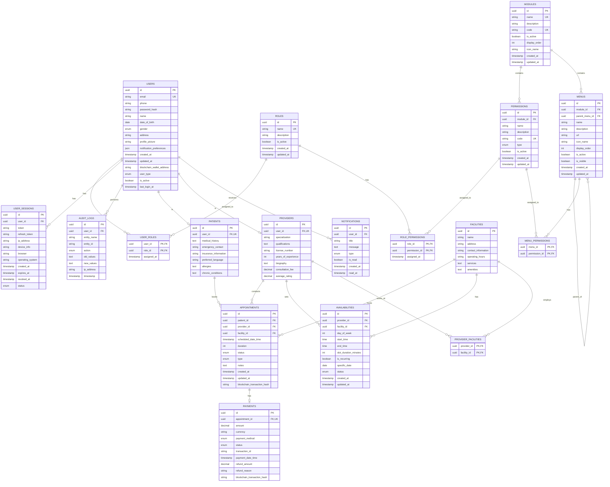

# Healthcare Appointment System Database Diagram

## Schema Visualization

The diagram above illustrates the complete database schema with all entities and their relationships. The schema follows the Third Normal Form (3NF) with proper separation of concerns and elimination of data redundancy.

### Key Features of the Schema:

1. **User Management Subsystem**
   - Users, Roles, and Permissions are properly separated
   - Many-to-many relationships are handled through junction tables
   - Role-based access control is implemented

2. **Menu and Module System**
   - Hierarchical menu structure with parent-child relationships
   - Modules group related functionality
   - Permissions are linked to both menus and roles

3. **Healthcare Domain Entities**
   - Patient and Provider profiles extend the base User entity
   - Appointments connect patients, providers, and facilities
   - Availability management for scheduling

4. **Payment and Notification Systems**
   - Payment tracking with blockchain integration
   - Comprehensive notification system

5. **Security and Auditing**
   - Session management for tracking user activity
   - Detailed audit logging for all operations

This normalized schema provides a solid foundation for the Healthcare Appointment System, ensuring data integrity, reducing redundancy, and supporting all the required functionality.